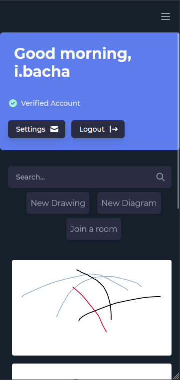

# Drawshift

## About:

Drawshift is a platform that enable its users to draw or make diagrams with other users in real-time

## Technologies:

- **Django Rest Framework**
- **Next.js**
- **Django Channels**
- **Tailwind**
- **PostgreSQL**
- **Redis**
- **Docker**

## Usage

In order to get it up and running you need to fire up the [Back-end](https://github.com/BachaZachry/Drawshift) first then run the following command:

```
yarn dev
```

## Functionalities

- Login, Registration using Knox Tokens
- Google Login
  
  
- Drawing or make diagrams (Solo)
  
  
  
- Drawing or make diagrams in a group real-time
  
- Save Drawings / Diagrams
  
  
- Download drawings as images
- Load saved Drawings
  

## [Backend Repo](https://github.com/BachaZachry/Drawshift)
